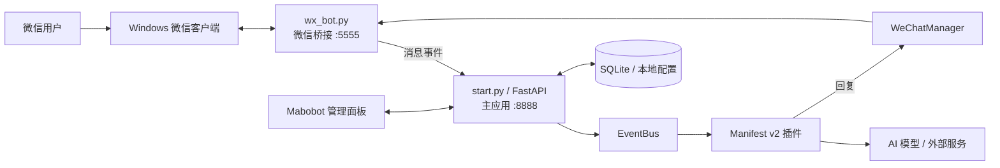

# Mabobot

Mabobot 是一个运行在 Windows 上的本地微信自动化助手。它把微信桌面端接入、消息监听、AI 对话、聊天记录和实用插件集中到一个 Web 管理面板中，模型与聊天数据默认保存在用户自己的电脑上。

> 管理面板面向可信局域网或 Tailnet，默认没有登录认证，并监听所有本机网络接口。请用 Windows 防火墙和 Tailscale ACL 限制访问范围，不要把 `8888` 端口映射到公网。详细边界见[安全策略](SECURITY.md)。

## 主要能力

- 微信接入：监听指定私聊或群聊，发送文本、图片和文件，并监控微信与监听窗口状态。
- AI 助手：支持多个模型供应商、独立 API Key、任务路由、角色、Judge 主动回复、内置网页搜索和连续对话。
- 聊天记录：按聊天保存文本、图片、链接和引用消息，并可在后台补充图片的视觉内容与可见文字。
- 聊天级权限：每个联系人或群聊可以分别选择允许使用的插件，群聊还可设置是否必须 `@机器人`。
- 插件系统：内置链接摘要、翻译、汇率、周报、磁链检查和菜单翻译，并支持按 Manifest v2 规范继续扩展。
- 本地管理：通过 Mabobot 管理面板维护聊天、插件、模型、任务路由、角色、Judge 和记忆设置。
- 运行恢复：提供 GUI 启动器、日志查看、微信在线检查、监听恢复和 Windows 登录后自动启动脚本。

首次启动不会预置模型、API Key 或聊天绑定。AI 长期记忆默认关闭，需要时再由用户开启。项目内置“默认助手”“刘局-和联胜”角色以及“默认 Judge”“刘局-和联胜 Judge”。

## 系统架构



| 组件 | 入口 | 主要职责 |
|---|---|---|
| 微信桥接 | `wx_bot.py`，默认端口 `5555` | 操作微信窗口、接收消息、发送内容、维护监听对象 |
| 主应用 | `start.py`，默认端口 `8888` | API、事件总线、插件、模型路由、后台任务和状态监控 |
| Web 管理面板 | `web/` | 聊天授权、AI 助手、插件、模型和运行日志管理 |
| 数据层 | `data/database.db` 等 | 系统设置、模型连接、权限、角色、Judge、聊天记录和记忆 |
| GUI 启动器 | `launcher.py` | 在 Windows 中启动、停止和重启两个服务并查看输出 |

消息主链路：

```text
微信消息
  -> wx_bot.py
  -> POST /api/internal/wechat_message
  -> EventBus 检查聊天权限与群聊 @ 条件
  -> 按全局顺序执行插件监听器
  -> 插件处理 / 调用任务路由中的 AI 模型
  -> WeChatManager
  -> wx_bot.py
  -> 微信回复
```

微信窗口操作和主应用分为两个进程。即使某个 AI 调用或插件出现异常，也可以单独重启主应用或微信桥接，减少对微信桌面端的影响。

## 运行要求

- Windows 10/11，且当前用户拥有可交互的桌面会话。
- 微信 4.1 客户端已经安装并登录。
- 64 位 Python 3.11 或 3.12；安装 Python 时勾选 `Add Python to PATH`。
- 使用 Git 获取和更新项目时，需要安装 [Git for Windows](https://git-scm.com/download/win)。
- `wxautox4` 可能需要单独购买并激活授权；依赖包会由安装脚本自动安装。
- 菜单翻译和链接摘要需要本机安装 Chrome。首次使用时 Selenium 可能需要联网获取匹配的浏览器驱动。
- 链接摘要的脑图渲染使用 Playwright Chromium，由一键安装脚本自动下载。
- 周报助手需要另行安装、登录并配置 Codex CLI；不使用周报时无需安装 Codex。

## 获取、安装与启动

### 方法一：使用 Git（推荐）

在 PowerShell 或 Windows Terminal 中运行：

```powershell
cd C:\Users\你的用户名
git clone https://github.com/Maaboubou/Mabobot.git
cd Mabobot
.\一键启动.bat
```

`git clone` 只在第一次使用时执行。建议把项目放在当前 Windows 用户有完整读写权限的目录中，例如 `C:\Users\你的用户名\Mabobot`，不要放到 `Program Files`。

### 方法二：下载 ZIP

在 GitHub 项目页面选择 `Code -> Download ZIP`，完整解压后双击项目根目录中的：

```text
一键启动.bat
```

不要只把 BAT 文件复制到桌面。如果需要桌面入口，请为原文件创建快捷方式。

### 一键启动会做什么

首次运行 `一键启动.bat` 时，安装脚本会自动：

1. 查找 64 位 Python 3.11/3.12。
2. 在项目目录创建独立虚拟环境 `.venv`。
3. 更新 `pip`、`setuptools` 和 `wheel`。
4. 安装 `requirements.txt` 中的全部依赖，包括 `wxautox4`。
5. 安装并验证链接摘要所需的 FFmpeg/FFprobe 与 Playwright Chromium。
6. 从 `.env.example` 创建本地 `.env`，但不会覆盖已经存在的配置。
7. 创建 `data/`、`logs/` 和 `tmp/` 运行目录。
8. 打开 GUI 启动器，由启动器管理微信桥接和主应用。

以后再次运行会复用 `.venv`；只有 `requirements.txt` 变化或环境不完整时才重新安装依赖。

如果只想安装或强制重装依赖，运行：

```text
Install.bat
```

环境准备好后，也可以直接运行 `Start-GUI.bat`。日常使用继续运行 `一键启动.bat` 更省心，它会先检查依赖是否仍然完整。

## 升级与更新记录

面向使用者的版本公告发布在 [GitHub Releases](https://github.com/Maaboubou/Mabobot/releases)，仓库内的长期变更记录见 [CHANGELOG.md](CHANGELOG.md)。

升级前建议先在“系统 → 备份与迁移”中创建并校验备份，然后停止正在执行的长任务、更新代码与依赖并重启 Mabobot。涉及插件接入方式或数据结构的版本会在 Release 公告中单独列出迁移提醒。

## 首次配置

### 1. 激活 wxautox4

如果所使用的授权需要激活，请按 wxautox4 供应商的说明操作。常见命令为：

```powershell
.\.venv\Scripts\wxautox4.exe -a <你的激活码>
```

激活码只应保留在本机，不要写入 README、`.env` 或提交到 Git。

### 2. 启动服务并打开管理面板

确认微信已经登录，在 GUI 启动器中启动全部服务。浏览器没有自动打开时，手动访问：

- Mabobot 管理面板：<http://127.0.0.1:8888/>
- API 文档：<http://127.0.0.1:8888/docs>
- 主应用健康检查：<http://127.0.0.1:8888/health>
- 微信桥接健康检查：<http://127.0.0.1:5555/health>
- 微信桥接进程存活检查：<http://127.0.0.1:5555/live>

### 3. 添加模型连接

进入“模型与调用 -> 模型连接”，创建要使用的模型：

1. 选择供应商或 OpenAI 兼容接口。
2. 填写一个便于识别且不重复的连接名称。
3. 填写模型 ID、API 地址和 API Key。
4. 保存后点击“测试”。

同一供应商可以创建多个模型连接，每个连接分别保存自己的 Key、API 地址和参数。例如可以同时创建“DeepSeek-个人”和“DeepSeek-团队”，互不覆盖。管理页面不会回显已经保存的原始密钥。

模型配置不是项目自带内容，首次安装时列表为空。没有添加模型并保存成功前，任务路由不会出现可选模型。

### 4. 配置任务路由

进入“模型与调用 -> 任务路由”，为插件声明的 AI 任务选择模型连接。常见任务包括：

| 任务 | 用途 |
|---|---|
| `builtin_chatbot.chat` | 普通聊天回复 |
| `builtin_chatbot.judge` | 群聊主动回复判断 |
| `builtin_chat_logger.image_understanding` | 为聊天记录图片补充场景、对象和可见文字 |
| `builtin_translation.translate` | 文本翻译 |
| `menu_translator.vision` | 菜单图片识别与翻译 |
| `summary_plus.summary` | 网页与公众号内容摘要 |
| `summary_plus.translate` | 为指定聊天追加摘要翻译 |
| `summary_plus.bilibili_mindmap` | B站视频字幕思维导图 |
| `summary_plus.youtube_mindmap` | YouTube 字幕思维导图 |

搜索不再需要独立模型路由。普通对话模型先用同一个 `builtin_chatbot.chat` 判断是否需要搜索，再由程序内置的 DDGS 执行检索；DDGS 不需要账号、API Key 或独立服务维护。本地 Codex 作为聊天模型时会跳过 DDGS，继续使用 Codex 原生搜索；“启用网页搜索”是两条路径共用的总开关。

引用图片回复也不再使用 Chatbot 的独立 `ocr` 或 `vision` 路由。聊天模型支持视觉时直接接收图片；不支持视觉时使用 `builtin_chat_logger.image_understanding` 生成的文字补充，补充失败则明确说明无法判断图片。

如果任务路由中没有模型选项，先确认“模型连接”页面已有保存成功的连接并通过测试，然后刷新任务路由页面。微信桥接、聊天记录、汇率和磁链检查等非 AI 功能不依赖模型。

### 5. 添加聊天并分配能力

进入“聊天”页面：

1. 添加需要监听的联系人或群聊，名称应与微信窗口中显示的名称一致。
2. 为该聊天勾选允许使用的插件。
3. 群聊按需要设置是否必须 `@机器人`。
4. 启动该聊天的监听。

手动停止某个聊天后，健康检查不会自动把它恢复；需要再次使用时，在管理面板中手动启动监听。

### 6. 设置角色、Judge 和记忆

进入“AI 助手”页面，为启用 Chatbot 的聊天选择：

- 角色：决定回答身份、语气和行为。
- Judge：决定群聊中没有明确 `@` 时是否主动参与。
- 主动回复：按聊天独立开启。
- 长期记忆：首次安装默认关闭，可全局或按聊天开启。

不需要主动插话时保持主动回复关闭。Judge 不替代任务路由；`builtin_chatbot.judge` 仍需要配置可用模型。

## Web 管理面板

| 工作区 | 路径 | 用途 |
|---|---|---|
| 概览 | `/` | 查看服务、微信、模型调用和近期活动 |
| 聊天 | `/chats` | 管理监听对象、插件权限、`@` 条件和聊天覆盖 |
| AI 助手 | `/assistant` | 管理聊天角色、Judge、主动回复和长期记忆 |
| 插件 | `/plugins` | 修改插件全局配置、定时任务和消息执行顺序 |
| 模型连接 | `/ai/models` | 添加模型、独立凭据和默认参数 |
| 任务路由 | `/ai/mappings` | 为各插件 AI 任务选择主模型和备用模型 |
| 用量统计 | `/ai/usage` | 查看模型调用统计 |
| 调用记录 | `/ai/calls` | 排查模型请求、响应和错误 |
| 运行与日志 | `/operations/logs` | 查看主应用和微信桥接日志 |
| 系统 | `/system` | 查看运行环境、微信身份和高级设置 |

敏感字段只显示是否已配置，不会在页面中回显原始值。

## 配置分层

| 层级 | 管理位置 | 内容 |
|---|---|---|
| 启动环境 | `.env` | 数据库地址、服务地址、端口、Codex 和可选通知参数 |
| 模型连接 | 管理面板、本机数据库 | 供应商、模型 ID、API 地址、API Key 和模型参数 |
| 任务路由 | 管理面板、本机配置 | 每项 AI 任务使用的主模型、备用模型和参数覆盖 |
| 插件配置 | “插件”页面、`config.json` | 触发词、超时、提示词、定时任务和能力默认值 |
| 聊天配置 | “聊天”“AI 助手”页面 | 插件权限、`@` 条件、角色、Judge、主动回复和记忆 |

`.env.example` 是可以提交的模板，`.env` 是本机实际配置并已被 Git 忽略。AI Key 推荐在管理面板中按模型连接填写，不需要把所有供应商密钥都写进 `.env`。

常用环境变量：

| 字段 | 默认值或用途 |
|---|---|
| `DATABASE_URL` | `sqlite:///data/database.db` |
| `WEB_HOST` | `0.0.0.0`，允许本机、局域网和 Tailscale 设备访问管理面板 |
| `WEB_PORT` | `8888`，管理面板与主应用端口 |
| `WX_BOT_PORT` | `5555`，微信桥接端口 |
| `WECHAT_BOT_NAME` | 机器人在微信中的显示名称 |
| `WEB_CORS_ORIGINS` | 前后端分离时允许的明确来源，默认留空 |
| `OPENAI_API_KEY` 等 | 可选的模型环境变量凭据；完整供应商字段见 `.env.example` |
| `CODEX_PROXY_*` | 周报及本机 Codex 集成参数 |
| `QQEMAIL_ADDR` / `QQEMAIL_CODE` | 可选的微信掉线或登录失败邮件通知 |
| `TIKHUB_API_TOKEN` | 可选；TikTok 解析及抖音/小红书 yt-dlp 失败后的回退使用 |
| `WECHAT_AUTOLOGIN_*` | Windows 登录后自动确认微信登录的等待与重试参数 |

`.env.example` 会随 Git 更新，但安装脚本不会覆盖已有的 `.env`。更新后如果新增了需要使用的功能，请对照新版 `.env.example`，把对应字段手动补入自己的 `.env`；不使用的字段无需复制或填写。

## 内置插件

| 插件 | 功能 | 典型触发 |
|---|---|---|
| `builtin_chat_logger` | 保存文本、图片、链接和引用消息，并可补充图片内容 | 已授权聊天中的消息 |
| `builtin_chatbot` | AI 对话、角色、Judge、网页搜索和本地记忆 | 私聊、群聊 `@`、Judge 或回复续接 |
| `builtin_translation` | 文本和引用消息翻译 | 已授权聊天中的非空文本 |
| `boc_rate` | 中国银行牌价、历史走势和汇率异动提醒 | “汇率”、币种关键词；定时任务 |
| `Weekly` | 根据聊天记录生成并推送周报 | 定时任务；管理员私聊命令 |
| `magnet_check` | 检查 InfoHash 或完整磁力链接并生成报告 | `验车 <InfoHash>` 或有效 magnet 链接 |
| `menu_translator` | 收集菜单图片并生成双语结果 | 菜单翻译关键词及后续图片会话 |
| `summary_plus` | 网页/公众号摘要、yt-dlp 平台媒体下载、字幕脑图 | 网页分享卡片或链接消息 |

插件的最终触发词、聊天范围和定时条件以各自 `manifest.json` 及“插件”页面显示为准。

链接摘要需要先为目标聊天授权 `summary_plus`，并在“任务路由”配置对应模型。普通网页和公众号链接使用独立的自动化 Chrome Profile；首次运行会创建 `tmp/chrome_data`。抖音和小红书优先使用 yt-dlp，并自动复用该调试 Chrome 中的登录态，无需手工维护 Cookie 文件；抖音失败后回退 TikHub，小红书失败后回退 TikHub/H5。小红书图文笔记保持单图输出 JPG、多图按配置合并成长图的效果。TikTok 解析及上述回退能力需要在 `.env` 填写可选的 `TIKHUB_API_TOKEN`。B站登录态也会尝试从该 Profile 自动获取，生成的 `cookies.txt` 已被 Git 忽略，不会上传。视频合并、转码和弹幕压制所需的 FFmpeg/FFprobe 由安装器放入 `.venv` 并自动使用，无需手动填路径。

## 权限与消息执行顺序

每个聊天对每个插件都有独立权限。`require_mention` 只约束群聊：

| 配置 | 私聊 | 群聊未 @ | 群聊已 @ |
|---|---|---|---|
| `require_mention = false` | 执行 | 执行 | 执行 |
| `require_mention = true` | 执行 | 跳过 | 执行 |

聊天管理页还提供独立的 **Codex 访问范围**：

- 新聊天默认使用“隔离空间”，只能读写 `data/codex_chat_scopes/<聊天名--hash>/`；同一群内成员共享同一个目录。
- 隔离调用使用一次性 Codex 进程，不继承用户 `config.toml` 与 `.rules`，本地命令网络关闭；已安装 Skill 的说明和资源目录保持只读可用。
- 只有私聊可以由 Web 管理员显式切换为“管理员 · 最大权限”。该模式继承本机 Codex 配置与规则、使用自动审批并保留持久会话。
- 访问模式保存在 `data/database.db`，聊天目录保存在 `data/codex_chat_scopes/`，服务重启不会丢失。模式切换会立即使旧 Codex 线程失效，避免跨权限复用。

插件监听器按 `app/plugins/routing_order.json` 中的全局顺序执行，可在管理面板调整。Manifest v2 支持三种消息传播方式：

- `observe`：只观察和记录，不阻止后续插件。
- `continue`：处理完成后继续执行后续插件。
- `stop_on_consumed`：真正命中并消费消息时停止后续处理。

插件开发约束见 [Manifest v2 插件开发指南](app/plugins/README.md)。

## 手动启动与状态检查

通常只需使用 GUI 启动器。需要排错或开发时，可以在两个 PowerShell 窗口中分别运行：

```powershell
# 窗口 1：微信桥接
.\.venv\Scripts\python.exe wx_bot.py
```

```powershell
# 窗口 2：主应用
.\.venv\Scripts\python.exe start.py --host 0.0.0.0 --port 8888
```

远程设备可使用 `http://<局域网IP>:8888`、`http://<Tailscale-IP>:8888`，或在 Tailnet 开启 MagicDNS 后使用 `http://<设备名>:8888`。微信桥接 `5555` 仍只监听本机，无需对外开放。

常用检查命令：

```powershell
curl.exe http://127.0.0.1:8888/health
curl.exe http://127.0.0.1:8888/api/system/status
curl.exe http://127.0.0.1:8888/api/wechat/status
curl.exe http://127.0.0.1:5555/live
curl.exe http://127.0.0.1:5555/health
curl.exe http://127.0.0.1:5555/api/listeners/status
```

`/live` 只表示桥接进程可响应；`/health` 返回微信连接、在线探针和监听器的缓存快照，不会在每次轮询时操作微信窗口。长期无人值守机器可先用 `/live` 区分进程故障，再查看 `/health` 中的 `health_status`、`online_probe`、`connection_id` 和监听器状态。桥接端口默认只监听本机，因此这些命令应在目标 Windows 主机中执行。

窗口看护会复用同一次 Win32 扫描，在窗口语义状态、可见性、最小化状态或 HWND/PID 发生变化时向 `logs/wx_bot.log` 写入 `listener_window_state_transition` 审计；`/health` 与 `/api/listeners/status` 的 `window_auto_repair.observation_audit` 同时提供当前观察和最近 20 次变化。变化记录中的 `previous_observed_at` 表示上一轮实际看到旧状态的时间，可用于判断故障信号究竟何时出现。

独立聊天窗口落入 Windows 的 `-32000` 无效位置时，微信桥接会用轻量 Win32 几何监测自动复位；该过程不激活、不关闭也不重建窗口。窗口真实缺失时，主应用会通过正常监听入口逐个恢复。

日志默认位于：

- `logs/app.log`：主应用、插件和后台任务。
- `logs/wx_bot.log`：微信桥接、窗口操作和监听器。
- `logs/gui_launcher.log`：GUI 启动器。
- `logs/wechat_auto_login.log`：自动登录流程。

## Windows 登录后自动启动

项目提供 `Start-WeChat-AutoLogin.bat`。它会等待 Windows 桌面和微信启动，尝试确认微信登录；微信在线后再启动 Mabobot。如果出现二维码，仍需人工扫码。

首次使用前先运行一次 `一键启动.bat`，完成虚拟环境安装和 wxautox4 激活，再双击 `Start-WeChat-AutoLogin.bat` 验证。

脚本不会自行创建开机任务。确认运行正常后，可以：

1. 按 `Win + R`，输入 `shell:startup`。
2. 为项目中的 `Start-WeChat-AutoLogin.bat` 创建快捷方式。
3. 把快捷方式放入打开的“启动”目录。

也可以使用 Windows 任务计划程序，但必须设置为“仅当用户登录时运行”，因为微信和窗口自动化需要可交互桌面。

## 数据、Chrome 与备份

### 本地数据

默认运行数据包括：

| 路径 | 内容 |
|---|---|
| `data/database.db` | 系统设置、聊天、权限、角色、Judge 和模型凭据 |
| `data/chat_logs/` | 按聊天保存的消息记录和媒体索引 |
| `data/llm_models.json` 等 | 模型、路由及运行配置 |
| `logs/` | 应用、桥接、启动器和自动登录日志 |
| `tmp/` | 可删除的临时文件 |
| 插件运行目录 | 汇率缓存、菜单图片/PDF、磁链报告等 |

`data/`、`logs/`、`tmp/`、`.env` 及插件生成内容均已被 Git 忽略，不会随 `git pull` 被覆盖，也不会提交到 GitHub。

这些目录可能包含聊天内容、密钥状态和个人信息，请按敏感数据处理。重要升级前，先在 GUI 中停止全部服务，再复制备份 `data/` 和 `.env`。不要在服务运行时直接删除或替换 SQLite 数据库。

### Chrome Profile

菜单翻译和链接摘要使用 Selenium 控制 Chrome。链接摘要的自动化 Profile 默认位于 `tmp/chrome_data`，会在运行时创建并与日常 Chrome 用户资料分开，通常不需要手动配置或迁移。Profile 或临时缓存被清理后，下次使用会重新创建，但网站登录态也会随之清除。

抖音和小红书下载会自动从该 Profile 的实时调试会话读取目标网站 Cookie，临时文件在每次调用后自动删除。如果登录态过期，`logs/app.log` 会记录 yt-dlp 的鉴权错误和 TikHub/H5 回退过程；在项目调试 Chrome 中重新登录对应网站即可，无需导出 `cookies.txt`。

如果首次启动浏览器失败，请确认 Chrome 已安装、网络可以获取匹配驱动，并查看 `logs/app.log`。

## 更新项目

### Git 安装

先在 GUI 中停止全部服务，然后在项目目录运行：

```powershell
cd C:\原来的\Mabobot
git status
git pull origin main
.\一键启动.bat
```

`一键启动.bat` 会在依赖文件改变时自动更新虚拟环境。`data/` 和 `.env` 不会被 Git 覆盖。

如果 `git status` 显示你修改了项目代码或插件自带的 `config.json`，先保存或提交这些改动，再执行 `git pull`，避免把本地改动直接覆盖。仅通过管理面板产生的数据库和运行数据不需要提交。

### ZIP 安装

下载新的 ZIP 并解压到新目录。停止旧服务后，把旧目录中的 `data/` 和 `.env` 复制到新目录，再运行 `一键启动.bat`。迁移前请保留旧目录作为备份，确认新版本运行正常后再删除。

## 常见问题

### 双击后提示找不到 Python

安装 64 位 Python 3.11 或 3.12，并在安装界面勾选 `Add Python to PATH`。安装完成后重新打开终端或重启电脑，再运行 `一键启动.bat`。

### 依赖安装失败

检查网络、代理和上方的 pip 错误。修复后运行 `Install.bat` 强制重新检查并安装依赖。不要把另一个项目的 `venv` 复制过来。

### wxautox4 无法使用或提示授权错误

确认使用项目 `.venv` 中的 wxautox4，并按供应商说明完成激活。运行 `.\.venv\Scripts\wxautox4.exe` 可以确认实际使用的程序路径。

### 管理面板打不开

确认 GUI 中“微信桥接”和“主应用”均已启动，再检查：

```powershell
curl.exe http://127.0.0.1:8888/health
curl.exe http://127.0.0.1:5555/health
```

仍失败时查看 `logs/gui_launcher.log`、`logs/app.log` 和 `logs/wx_bot.log`。如果端口被占用，可在 `.env` 中修改 `WEB_PORT` 和 `WX_BOT_PORT`，保存后重启全部服务。

### 任务路由没有可选模型

先到“模型连接”创建并保存模型，点击“测试”确认连接可用，再刷新“任务路由”。同一供应商的不同 Key 应创建成不同连接，而不是反复修改同一个连接。

### 已添加聊天但机器人不回复

依次检查：

1. 微信客户端是否在线，聊天名称是否完全一致。
2. 对应聊天的监听是否已经启动。
3. 聊天是否已获得目标插件权限。
4. 群聊是否要求 `@机器人`。
5. AI 任务是否配置了可用模型路由。
6. “运行与日志”中是否有模型、权限或窗口错误。

### 手动停止监听后又不想让它自动恢复

手动停止状态会持久保存，健康检查不会自动恢复该聊天。需要重新监听时，在“聊天”页面手动点击启动。

### 菜单翻译没有打开 Chrome 或一直等待图片

确认 Chrome 已安装，聊天已获得 `menu_translator` 权限，并先发送插件配置中的菜单翻译触发词，再在会话时限内发送图片。查看 `logs/app.log` 可确认浏览器和模型调用错误。

### 链接没有生成摘要或脑图

确认聊天已获得 `summary_plus` 权限，并已为 `summary_plus.summary` 及需要的脑图任务配置模型路由。普通链接还要确认 Chrome 能正常启动；脑图或媒体处理失败时可重新运行 `Install.bat` 检查 Playwright Chromium、yt-dlp 与 FFmpeg。抖音或小红书日志出现 Cookie/登录态错误时，请在项目调试 Chrome 中重新登录；yt-dlp 失败后会自动记录并回退 TikHub/H5。B站、YouTube 或其他媒体下载问题通常还与登录态、字幕可用性和网络有关，具体原因可在 `logs/app.log` 查看。

### 周报助手无法运行

周报依赖本机 Codex CLI。确认 Codex 已安装并登录，然后根据实际安装位置设置 `CODEX_PROXY_USE_WSL`、`CODEX_PROXY_WSL_BIN` 或 `CODEX_PROXY_BIN`。不使用周报时可停用 `Weekly` 插件。

## 项目结构

```text
Mabobot/
├── app/
│   ├── api/                    # FastAPI 路由与管理 API
│   ├── core/                   # 事件总线、插件管理、消息顺序、微信管理
│   ├── models/                 # SQLAlchemy 数据模型
│   ├── plugins/                # 8 个内置插件及 Manifest
│   ├── services/               # AI、配置、记忆、监控和后台服务
│   └── utils/                  # 微信媒体、发送、配置等通用工具
├── data/                       # SQLite、聊天记录和本地运行数据
├── docs/                       # 模型与记忆专项文档
├── scripts/
│   └── install.ps1             # Windows 环境与依赖安装器
├── web/                        # Mabobot 单页管理面板
├── .env.example                # 可公开的环境变量模板
├── requirements.txt            # Python 运行依赖
├── launcher.py                 # Windows GUI 服务启动器
├── start.py                    # FastAPI 主应用入口
├── wx_bot.py                   # 微信桥接进程
├── wechat_auto_login.py        # 微信自动登录与启动协调
├── 一键启动.bat                # 安装检查并打开 GUI
├── Install.bat                 # 强制安装依赖
├── Start-GUI.bat               # 直接打开 GUI
└── Start-WeChat-AutoLogin.bat  # Windows 登录后自动启动入口
```

## 插件开发

每个插件至少包含：

```text
app/plugins/my_plugin/
├── config.json       # 插件元数据、配置说明和默认值
├── manifest.json     # 监听器、触发条件、范围、传播方式和定时任务
└── main.py           # register / unregister 与处理逻辑
```

监听顺序只有 `app/plugins/routing_order.json` 一个事实来源。Manifest 声明应与插件实际注册的事件保持一致，不要在单个插件中另建一套优先级。

更多字段、事件和会话型插件约束见 [Manifest v2 插件开发指南](app/plugins/README.md)。

## 相关文档

- [模型连接与任务路由](docs/MODEL_CONFIGURATION.md)
- [AI 助手记忆库](docs/MEMORY_LIBRARY.md)
- [Manifest v2 插件开发指南](app/plugins/README.md)
- [中国银行汇率插件](app/plugins/boc_rate/README.md)
- [磁链检查插件](app/plugins/magnet_check/README.md)
- [安全策略](SECURITY.md)
- [wxautox 官方文档](https://docs.wxauto.org/docs/install.html)

## 安全与部署

- 默认监听 `0.0.0.0:8888`，可从可信局域网与 Tailnet 访问；使用 Windows 防火墙和 Tailscale ACL 限制设备范围。
- 不要在路由器配置公网端口映射，也不要在没有认证的情况下把管理面板暴露到公网。
- 公网部署必须放在带身份认证和 TLS 的反向代理之后。
- 不要提交 `.env`、`data/`、聊天日志、下载媒体、数据库或任何真实凭据。
- 分享日志前先检查其中是否包含聊天内容、联系人名称、API 地址或异常响应。
- 升级和迁移前停止服务并备份 `data/` 与 `.env`。

## 许可证

项目使用 [MIT License](LICENSE)。

问题与改进建议请提交到 [GitHub Issues](https://github.com/Maaboubou/Mabobot/issues)。
