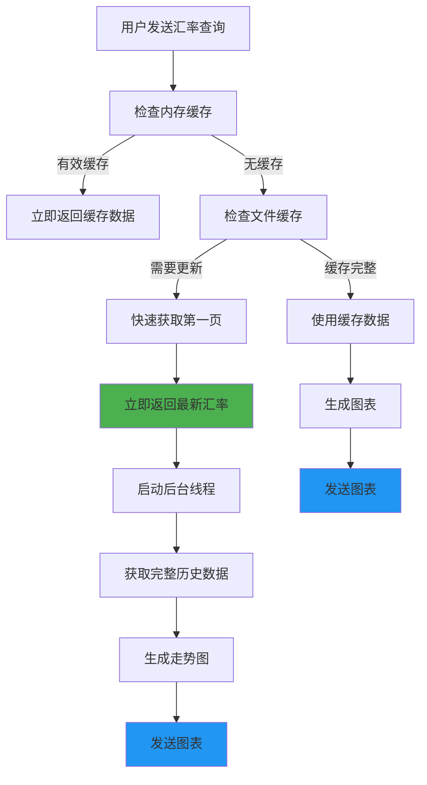

# BOC 中国银行汇率查询插件

## 📋 插件概述

BOC汇率插件是一个功能强大的微信机器人插件，用于实时查询中国银行外汇牌价。该插件提供快速响应的汇率查询和美观的历史走势图表，支持46种主要货币的汇率查询。

## ✨ 主要特性

### 🚀 快速响应
- **3秒内返回最新汇率**：优化后的查询机制，优先获取第一页最新数据
- **后台完整更新**：在后台异步获取完整历史数据，不影响用户体验
- **智能缓存系统**：内存缓存 + 文件缓存双重机制，提升响应速度

### 💰 汇率查询
- **46种货币支持**：美元、欧元、英镑、日元等主要货币
- **实时数据**：直接从中国银行官网获取最新牌价
- **多种触发方式**：支持货币名称、简称、符号等多种查询方式

### 📊 可视化图表
- **精美走势图**：自动生成30天历史走势图
- **关键点标注**：自动标注最高点、最低点、最新点
- **数据统计**：显示平均值、数据点数量等统计信息

## 🎯 使用方法

### 基本查询
```
汇率
美元汇率
欧元
USD
JPY汇率
```

### 支持的货币列表
| 货币名称 | 别名 | 代码 |
|---------|------|------|
| 美元 | 美金、dollar | USD |
| 欧元 | euro | EUR |
| 英镑 | pound | GBP |
| 港币 | 港元 | HKD |
| 日元 | yen | JPY |
| 瑞士法郎 | 瑞郎 | CHF |
| 加拿大元 | 加币 | CAD |
| 澳大利亚元 | 澳元 | AUD |
| 新加坡元 | 新币 | SGD |
| ... | ... | ... |

*完整货币列表请查看源码中的 `CURRENCY_MAPPING`*

## 🏗️ 架构设计

### 核心文件结构
```
app/plugins/boc_rate/
├── main.py                    # 插件入口和事件处理
├── boc_exchange_service.py    # 核心业务逻辑
├── net_utils.py              # 网络请求工具
├── config.json               # 插件配置
├── exchange_rate_cache/      # 数据缓存目录
│   ├── cache_index.json      # 缓存索引
│   └── 货币名_日期.json       # 每日数据缓存
└── README.md                 # 本文档
```

### 执行流程



## ⚡ 性能优化

### 响应时间优化
- **首次查询**：3-5秒内返回最新汇率
- **缓存命中**：1秒内返回结果
- **图表生成**：后台异步处理，不阻塞用户

### 缓存策略
1. **内存缓存**：30分钟有效期，最快响应
2. **文件缓存**：按日期分文件存储，支持离线查询
3. **增量更新**：只获取缺失日期的数据，减少网络请求

### 并发控制
- **查询锁机制**：防止重复查询造成资源浪费
- **线程安全**：支持多用户并发查询
- **优雅降级**：网络异常时使用缓存数据

## 🛠️ 技术栈

### 核心依赖
- **Python 3.7+**
- **requests**：HTTP请求处理
- **lxml**：HTML解析
- **matplotlib**：图表生成
- **ddddocr**：验证码识别
- **pytz**：时区处理

### 外部接口
- **中国银行公开外汇牌价快照页（最新牌价/盘中快照）**
  - 当前牌价：`https://www.boc.cn/sourcedb/whpj/index.html`
  - 近期快照：`index_1.html` 至官网当前公布的最后一页
  - 无需验证码，插件并发抓取后按币种和发布时间解析
- **新浪财经保存的中行人民币牌价历史数据（30天走势图补齐）**
  - 地址：`https://biz.finance.sina.com.cn/forex/forex.php`
  - 提供每日中行牌价，插件自动翻页并与中行官网盘中快照合并
  - 支持美元、英镑、欧元、澳门元、泰国铢、菲律宾比索、港币、瑞士法郎、新加坡元、瑞典克朗、丹麦克朗、挪威克朗、日元、加拿大元、澳大利亚元、新西兰元、韩国元
- **中国银行历史牌价检索页（仅供人工检索）**
  - 页面：`https://www.boc.cn/sourcedb/whpjSearch/index.html`
  - 旧 `search_cn.jsp` 已下线；新 JSON 查询接口要求极验验证，插件不调用

## 📁 缓存机制

### 文件缓存格式
```json
{
  "metadata": {
    "currency": "欧元",
    "date": "2025-08-20",
    "record_count": 9,
    "cached_at": "2025-08-20T01:02:26.729000",
    "data_version": "2.0"
  },
  "records": [
    {
      "货币名称": "欧元",
      "现汇买入价": "838.12",
      "现钞买入价": "814.96",
      "现汇卖出价": "839.87",
      "现钞卖出价": "863.69",
      "中行折算价": "839.13",
      "发布时间": "2025.08.20 05:30:00"
    }
  ]
}
```

### 缓存更新策略
- **今日数据**：每10分钟检查更新
- **历史数据**：永久缓存，除非手动清理
- **自动清理**：超过30天的数据可配置自动清理

## 🔧 配置说明

### config.json
```json
{
  "name": "boc_rate",
  "description": "中国银行外汇牌价查询插件",
  "version": "2.0.0",
  "config_schema": {
    "trigger_keywords": {
      "type": "array",
      "group": "trigger",
      "default": ["汇率", "中行", "牌价"]
    }
  },
  "config": {
    "trigger_keywords": ["汇率", "中行", "牌价"]
  }
}
```

事件、触发范围、传播方式和每日任务由同目录的 `manifest.json` 声明；实际执行位置由全局 `app/plugins/routing_order.json` 管理，不在插件内设置顺序数值。

## 📈 使用示例

### 查询欧元汇率
**输入：** `欧元汇率`

**输出：**
```
💰 欧元中行牌价(现汇卖出价)
📈 839.87
🕐 2025.08.20 05:30:00
```

随后会收到精美的30天走势图，包含：
- 历史价格趋势线
- 最高点、最低点标注
- 平均价格线
- 最新价格点
- 数据统计信息

## 🚨 错误处理

### 常见错误及处理
1. **验证码识别失败**：自动重试3次
2. **网络超时**：使用缓存数据降级
3. **数据解析错误**：记录日志并返回友好提示
4. **并发冲突**：排队处理，避免重复请求

### 日志级别
- **INFO**：正常操作和缓存命中
- **WARNING**：使用降级方案的情况
- **ERROR**：严重错误和异常情况

## 🔍 故障排查

### 常见问题
1. **响应慢**：检查网络连接和缓存状态
2. **图表不显示**：检查matplotlib依赖和临时文件权限
3. **验证码失败**：检查ddddocr包和模型文件
4. **数据不准确**：清理缓存并重新获取

### 调试模式
修改日志级别为DEBUG可查看详细执行过程：
```python
logging.getLogger('app.plugins.boc_rate').setLevel(logging.DEBUG)
```

## 🔄 版本历史

### v2.0.0 (当前版本)
- ✅ 快速响应优化：3秒内返回最新汇率
- ✅ 后台异步处理：不阻塞用户体验
- ✅ 双重缓存机制：内存 + 文件缓存
- ✅ 增量数据更新：只获取缺失数据
- ✅ 精美图表设计：多种标注和统计信息
- ✅ 线程安全：支持并发查询
- ✅ 错误处理：完善的异常处理和降级机制

### v1.0.0
- 基础汇率查询功能
- 简单图表生成
- 基础缓存机制

## 📝 开发说明

### 扩展新功能
1. **添加新货币**：在 `CURRENCY_MAPPING` 中添加映射关系
2. **修改图表样式**：在 `_create_trend_chart` 方法中调整样式
3. **优化缓存策略**：修改 `cache_duration` 和相关逻辑

### 测试建议
- 测试各种货币查询
- 验证缓存命中和失效
- 检查并发场景
- 验证网络异常处理

## 📞 技术支持

如有问题或建议，请：
1. 检查日志文件获取详细错误信息
2. 查看本文档的故障排查部分
3. 提交Issue时请包含错误日志和复现步骤

---

*本插件致力于为用户提供快速、准确、美观的汇率查询体验。*
